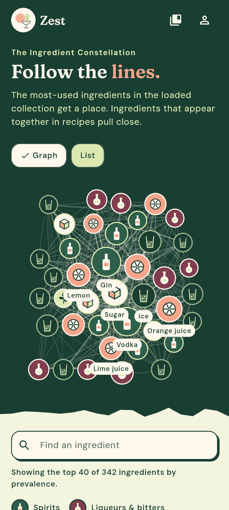
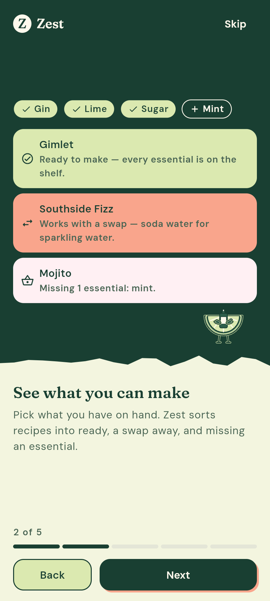
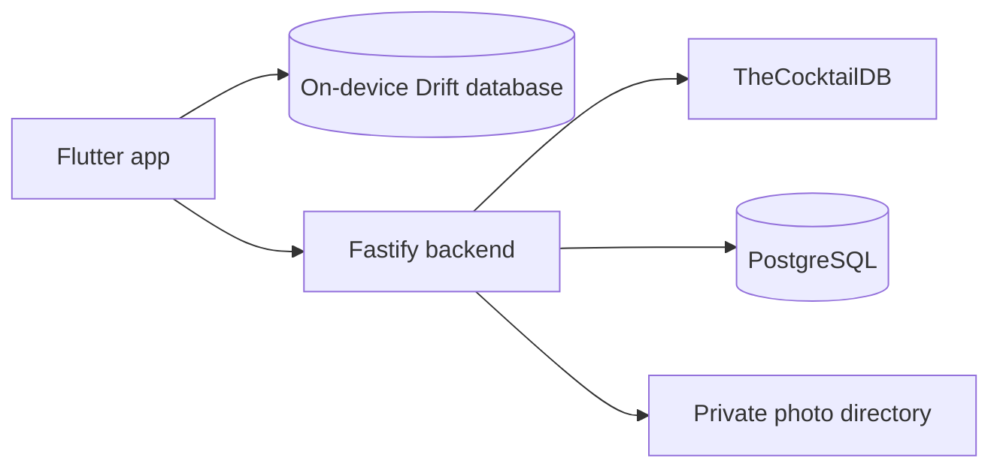

# Zest

Zest is a personal cocktail companion built around the ingredients you have and the drinks you want to remember. Its home screen is an ingredient constellation: a visual map of which ingredients appear together across the locally loaded recipe collection.

The app combines recipe discovery, a persistent home bar and shopping list, practical matching, a dated drink collection, personal variations, memory photos, and account-backed sync. The interface uses Zest's Botanical Play and Night Garden design system rather than stock Material styling.

<p align="center">
  
  &nbsp;
  
</p>

## What Zest does

- Explores ingredient relationships through a bounded co-occurrence graph, with an accessible list alternative.
- Searches and browses TheCocktailDB recipes by name, ingredient, and first letter.
- Keeps catalog ingredients in a synced home bar or shopping list, and sorts local or selected recipes into ready to make, possible with a reviewed substitution, and missing essentials.
- Saves drinks to a calendar and keeps personal variations distinct from their source recipes.
- Attaches one private memory photo to a saved drink or variation.
- Works from on-device Drift databases and syncs collection entries, home-bar items, shopping items, and photos through Zest's own account backend.
- Handles loading, empty, error, reduced-motion, large-text, and keyboard-access paths as part of each feature.

## Architecture



The Flutter app remains usable offline from its local collection and home bar. The backend holds the recipe-provider key, authenticates users, resolves collection and home-bar synchronization, stores account data in PostgreSQL, and keeps photo files on server disk. It currently targets local development on a trusted computer or home network; public deployment is not configured.

## Repository layout

```text
frontend/   Flutter application
backend/    TypeScript/Fastify gateway, accounts, sync, and photo storage
docs/       Product contracts, design system, milestone records, and reviews
```

The main references are [the product brief](docs/PRODUCT.md), [roadmap](docs/ROADMAP.md), [design system](docs/DESIGN.md), [account and sync contract](docs/ACCOUNTS.md), and [data-source rights record](docs/SOURCES.md).

## Run locally

You need Flutter 3.44 or newer, Node.js 24 or newer, and Docker Compose.

Install the backend dependencies and create its ignored environment file:

```powershell
cd backend
npm ci
Copy-Item .env.example .env
```

The example uses TheCocktailDB's documented development key `1`. If you have a Premium key, put it only in `backend/.env` as `COCKTAIL_DB_API_KEY`. Never place it in Flutter configuration or tracked files.

Start PostgreSQL, apply the committed migrations, and run the development server:

```powershell
docker compose -f docker-compose.dev.yml up -d
npm run db:migrate
npm run dev
```

In another terminal:

```powershell
cd frontend
flutter pub get
flutter run -d chrome --web-port=5173
```

The app defaults to `http://127.0.0.1:3000/api/cocktails/`. A different backend address can be supplied with a trailing slash:

```powershell
flutter run -d <device-id> --dart-define=ZEST_API_BASE_URL=http://<host>:3000/api/cocktails/
```

Phone access requires binding the backend to the LAN and has clear security limits: there is no HTTPS, and every device on that Wi-Fi can reach the service. Follow the warning and configuration steps in [backend/README.md](backend/README.md) before enabling it.

## Verification

Run Flutter checks from `frontend/`:

```powershell
flutter analyze
flutter test
```

Run backend checks from `backend/`:

```powershell
npm run typecheck
npm test
npm run build
```

Tests use synthetic recipe-shaped fixtures, an in-process PGlite database, and temporary photo storage. They do not require provider traffic, Docker, private credentials, or personal media.

## Data, photos, and current limits

TheCocktailDB remains the recipe source. Provider recipes and images are fetched at runtime and are not committed to this repository. Zest's own backend syncs saved source snapshots and owner-readable memory photos; the published provider terms do not explicitly address that storage, which is recorded as an accepted risk in [docs/SOURCES.md](docs/SOURCES.md).

Zest has no public-server configuration, HTTPS termination, backups, password reset, email verification, or account deletion yet. The local server is development infrastructure, not a production deployment.

## License and credits

Zest's original application and backend code are licensed under the [MIT License](LICENSE). That license does not cover TheCocktailDB recipes or artwork, the bundled Fraunces and DM Sans fonts, or third-party packages; see [NOTICE.md](NOTICE.md).

Recipe data and artwork come from [TheCocktailDB](https://www.thecocktaildb.com/). The exact published terms Zest relies on, along with the unresolved points, are documented in [docs/SOURCES.md](docs/SOURCES.md).
